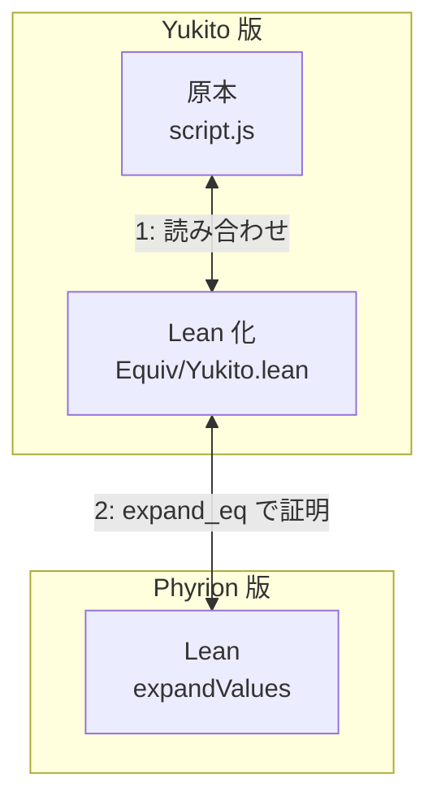

# 1y-expand-equiv

2026 年 9 月 10 日に Phyrion 氏の Lean 4 による 1-Y 数列の整礎性・整列性の[形式化](https://github.com/Phyrion1343/1Y-Well-Ordering-Lean)が公開された。

ただし Phyrion 氏の[論文](https://github.com/Phyrion1343/1Y-Well-Ordering-Lean/blob/6533b2975f3cafb3582dc8f8127e9ea7144d7e69/Well-Ordering%20of%20the%201-Y%20Sequence%20System.pdf)にはこう書かれており、Phyrion 版は Yukito 版の形式化であるとは主張していない。

> The precise convention considered here is the ancestor-preserving algorithm below and in
> the fixed source snapshot. No equivalence with every variant described elsewhere is assumed.

それを受けてこのリポジトリでは 1-Y 数列の展開規則について、次の 2 つが同じ関数であることを検証する。

| | 何か | 場所 |
|---|---|---|
| Yukito 版 | Yukito 氏による 1-Y の展開規則 | [Naruyoko/YNySequence](https://github.com/Naruyoko/YNySequence) の revision 2de1397 の [`script.js`](https://github.com/Naruyoko/YNySequence/blob/2de13970b9ac818c935577b8284c41dec01f0039/script.js) の `expand` |
| Phyrion 版 | Phyrion 氏が独自に定めた祖先保存アルゴリズム | [Phyrion1343/1Y-Well-Ordering-Lean](https://github.com/Phyrion1343/1Y-Well-Ordering-Lean) の revision 6533b29 の [`OneY.Numeric.expandValues`](https://github.com/Phyrion1343/1Y-Well-Ordering-Lean/blob/6533b2975f3cafb3582dc8f8127e9ea7144d7e69/formalization/OneY/Expansion.lean#L46) |

## 検証方法

下記のように、js である Yukito 版 をまず Lean に翻訳した。これが [`Equiv/Yukito.lean`](Equiv/Yukito.lean) である。

その上で、[`Equiv/Yukito.lean`](Equiv/Yukito.lean) の `expandJS` と、Phyrion 版の `expandValues` が同じ関数であることを定理 `expand_eq` で証明した。 



## 検証結果

### (1) Yukito 版(js) ⇔ Yukito 版(lean) の対応

`script.js` の本文と `Equiv/Yukito.lean` の本文の対応は [correspondence.md](correspondence.md) である。ここの翻訳の正しさは、見比べるしかない。

### (2) Yukito 版(lean) = Phyrion 版(lean) の証明

[`Equiv/Lower.lean`](Equiv/Lower.lean#L1506) の `expand_eq` で証明した。

```lean
theorem expand_eq (s : List Nat) (hs : ZeroY.Legal s) (N m efuel : Nat)
    (hm : sequenceBound s ≤ m) (hml : s.length ≤ m) (hef : sequenceBound s ≤ efuel)
    (hn : 0 < s.length) :
/-  Yukito 版                                                       Phyrion 版
    _____________________________________________________________   ___________________ -/
    expandOut (expandJS N (m + 1) efuel (calcMountain s (m + 1))) = expandValues s hs N
```

- Yukito 版:
  - [`calcMountain s (m + 1)`](Equiv/Yukito.lean#L129) = [`calcMountain(s)`](https://github.com/Naruyoko/YNySequence/blob/2de13970b9ac818c935577b8284c41dec01f0039/script.js#L32)
  - [`expandJS N (m + 1) efuel …`](Equiv/Yukito.lean#L578) = [`expand`](https://github.com/Naruyoko/YNySequence/blob/2de13970b9ac818c935577b8284c41dec01f0039/script.js#L175)
  - [`expandOut …`](Equiv/Yukito.lean#L574) = `stringify`
- `N` はどちらも展開の回数（`script.js` の `n`）である。
- `ZeroY.Legal s` は「すべての要素が正」かつ「先頭が 1」で、Phyrion 版が `expandValues` に 課している条件そのものである。標準形の Y 数列はこれを満たす。
- `m` と `efuel` は燃料で、 `sequenceBound s`（値の最大）と列の長さ以上あれば足りる。

`sorry` は無く、公理は `propext` / `Classical.choice` / `Quot.sound` のみ。

したがって Phyrion 版の整礎性・整列性の結果は、そのまま Yukito 版の 1-Y についての
結果になる。

## 座標の対応

列 (1,2,4,8) の山。

Yukito 版

```
row 3: {value 1, position 0}
row 2: {value 1, position 0} {value 2, position 1}
row 1: {value 1, position 0} {value 2, position 1} {value 4, position 2}
row 0: {value 1, position 0} {value 2, position 1} {value 4, position 2} {value 8, position 3}
```

Phyrion 版

```
        c=0  c=1  c=2  c=3
row 3    -    -    -    1
row 2    -    -    1    2
row 1    -    1    2    4
row 0    1    2    4    8
```

## 証明の骨格

[Equiv/README.md](Equiv/README.md) にある。

## ビルド

Lean 4.33.1 が要る。依存として Phyrion 版の形式化を兄弟ディレクトリに置く。

```sh
git clone https://github.com/Phyrion1343/1Y-Well-Ordering-Lean
git clone git@github.com:koteitan/1y-expand-equiv
cd 1y-expand-equiv
lake --keep-toolchain --no-cache build Equiv
```

`lakefile.toml` は依存を `../1Y-Well-Ordering-Lean/formalization` として参照する。
